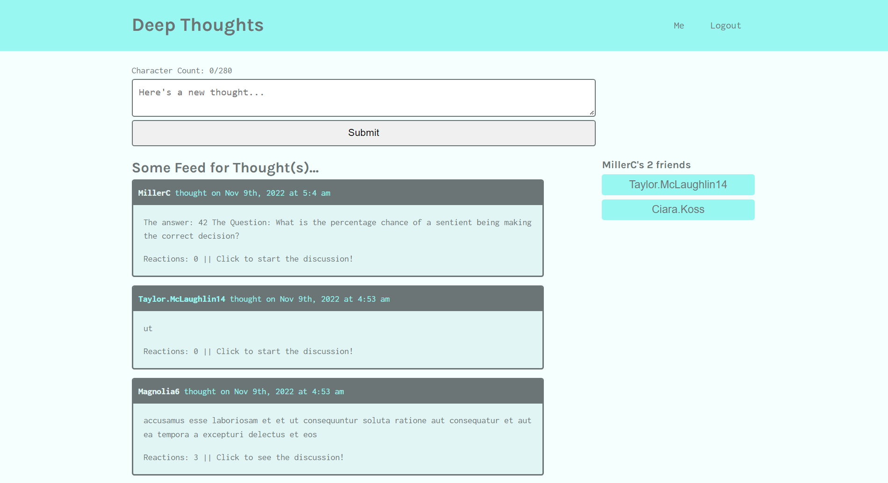
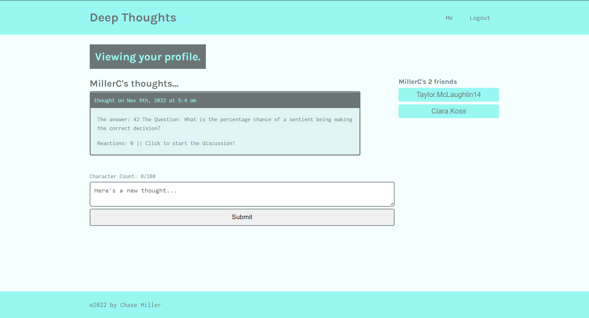
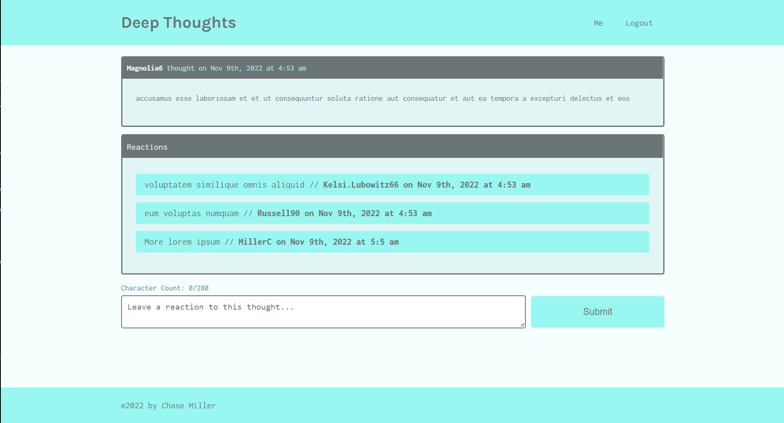

# Deep Thoughts

Deep thoughts is a simple social media site for users to share and discuss thoughts, as well as add and keep track of friends.

#### Deployed at: [https://deep-thoughts-example.herokuapp.com/](https://deep-thoughts-example.herokuapp.com/)

---

## Table of Contents

1. [Usage](#usage)

2. [License](#license)

3. [Questions](#questions)

---

## Usage

Simply navigate to and use the sign up page to create your own profile. This will give you the ability to create posts from the home page, as well as grants access to your own profile page where you can see your own posts, create new posts, and see your friends list with quick navigation to their profiles.

#### Homepage

---

#### Profile page

---

#### Single thought / Reaction page

---

## License

Copyright &copy; 2022 Chase Miller &lt;millerchase>

Permission is hereby granted, free of charge, to any person obtaining a copy of this software and associated documentation files (the "Software"), to deal in the Software without restriction, including without limitation the rights to use, copy, modify, merge, publish, distribute, sublicense, and/or sell copies of the Software, and to permit persons to whom the Software is furnished to do so, subject to the following conditions:

The above copyright notice and this permission notice shall be included in all copies or substantial portions of the Software.

THE SOFTWARE IS PROVIDED "AS IS", WITHOUT WARRANTY OF ANY KIND, EXPRESS OR IMPLIED, INCLUDING BUT NOT LIMITED TO THE WARRANTIES OF MERCHANTABILITY, FITNESS FOR A PARTICULAR PURPOSE AND NONINFRINGEMENT. IN NO EVENT SHALL THE AUTHORS OR COPYRIGHT HOLDERS BE LIABLE FOR ANY CLAIM, DAMAGES OR OTHER LIABILITY, WHETHER IN AN ACTION OF CONTRACT, TORT OR OTHERWISE, ARISING FROM, OUT OF OR IN CONNECTION WITH THE SOFTWARE OR THE USE OR OTHER DEALINGS IN THE SOFTWARE.

[https://opensource.org/licenses/MIT](https://opensource.org/licenses/MIT)

## Questions

For any additional questions:

- Find me on GitHub @ [millerchase](https://github.com/millerchase)

- Or contact me directly at: mlr.chase40@gmail.com
